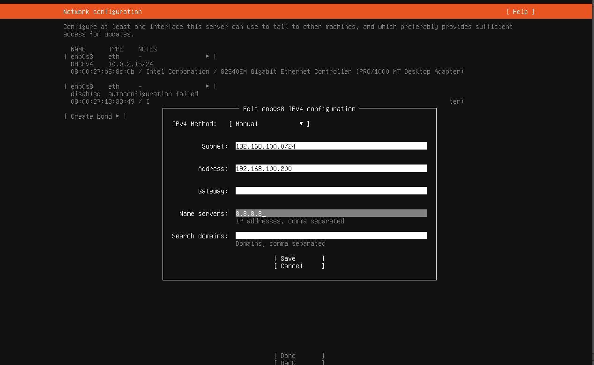

# VIRTUAL BOX,  VIRTUAL MACHINE

Este tutorial esta destinado para crear un VM desde un ISO de un sistema operativo LINUX

1. Descargar el ISO
2. Configurar la maquina virual en LINUX
  Nombre
  El ISO
  La RED
    Redes solo anfitrion, aca se configura el apigateway
    Redes NAT, para tener acceso a internet
  Al ingresar nuevamente a la maquina, se debe configurar el IP en base al apigateway

01

02

03

04

05

06

07

