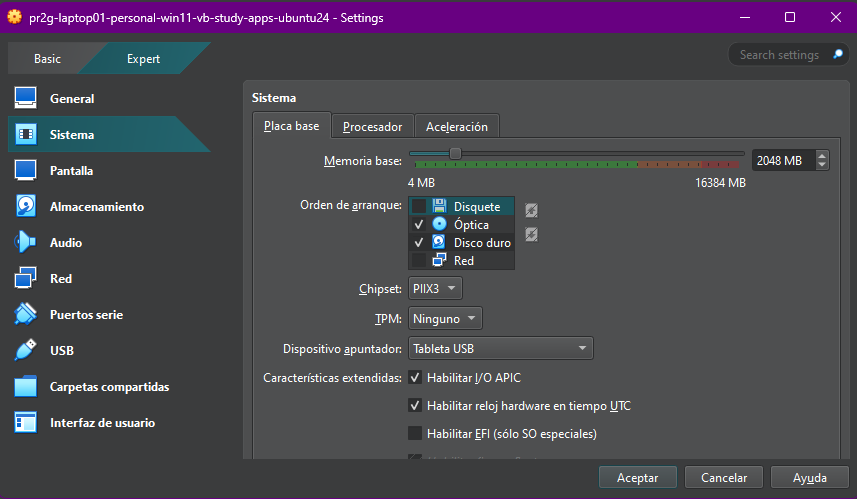
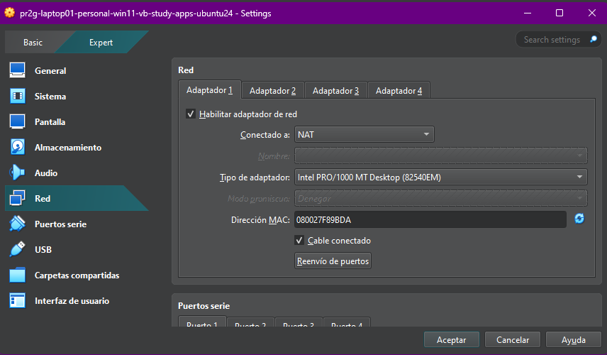
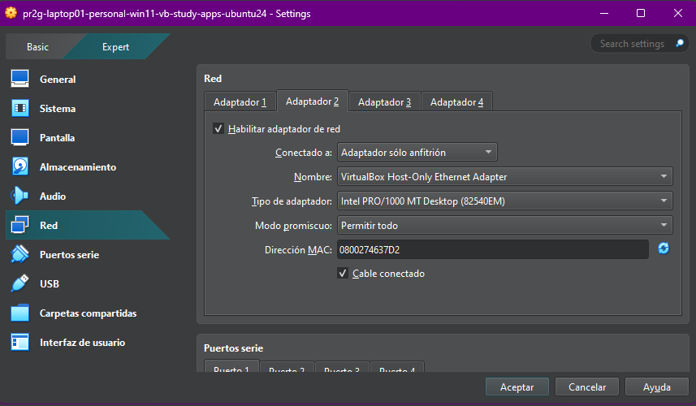

# VIRTUAL BOX,  VIRTUAL MACHINE

Este tutorial esta destinado para crear un VM desde un ISO de un sistema operativo LINUX

1. Descargar el ISO
2. Configurar la maquina virual en LINUX
  Nombre
  El ISO
  La RED
    Redes solo anfitrion, aca se configura el apigateway
    Redes NAT, para tener acceso a internet
  Al ingresar nuevamente a la maquina, se debe configurar el IP en base al apigateway

01

02

03

04

05

06

07

IPv4 Method: Asegúrate de que esté seleccionado Manual. (Ya lo está en la imagen).
Subnet: Aquí debes poner la red en formato CIDR. Tu red es 192.168.207.0 con máscara 255.255.255.0, que en formato CIDR es /24.
Coloca: 192.168.207.0/24
(Nota: La pantalla sugiere que la máscara de subred "should be in CIDR form", pero en el campo "Subnet" usualmente se pone la dirección de red en CIDR. Pon la red en CIDR como se indica)
Address: Aquí va la dirección IP estática que quieres para tu máquina virtual en esta red. Sugiero 192.168.207.10.
Coloca: 192.168.207.10
Gateway: Aquí va la dirección IP de la máquina anfitriona en esta red Sólo Anfitrión. Según tu configuración de VirtualBox, es 192.168.207.1.
Coloca: 192.168.207.1
Name servers: Los servidores DNS. Para esta interfaz de Host-Only, no son estrictamente necesarios para la comunicación host-VM, ya que el internet vendrá por el adaptador NAT. Puedes poner un servidor DNS público confiable como respaldo, o a veces es posible dejarlo en blanco si el instalador lo permite. Si el instalador requiere algo, puedes poner un DNS público.
Coloca (opcional, si es requerido o deseas un respaldo): 8.8.8.8 (Es un DNS público de Google)
Search domains: Puedes dejar esto en blanco.

configure
.ssh
copiar el ssh del host hacia la maquina virtual

En windows con gitbash

ssh-copy-id -i ~/.ssh/paul-me-id-key_ed25519.pub paul@192.168.207.10

scp -r ~/.ssh paul@192.168.207.10:/home/paul/.ssh
scp -r ~/.npmrc paul@192.168.207.10:/home/paul/.npmrc
ssh paul@192.168.207.10 "chmod 700 ~/.ssh && chmod 600 ~/.ssh/*"
